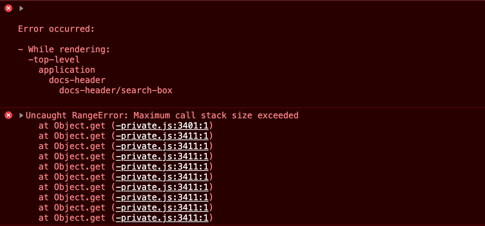

# `ember-cli-addon-docs` with V2 addon issue

- Created a new V2 addon with `ember install ember-cli-addon-docs`
- Tried to run `ember install ember-cli-addon-docs` in the `test-app` directory, got error:
  - Cannot find module '/Users/jbarry/Development/my-addon/node_modules/parse5/lib/index.js'. Please verify that the package.json has a valid "main" entry
  - This is probably expected since this is a V2 addon.
- Manually had to install each package
  ```bash
  yarn add -D ember-cli-addon-docs ember-cli-addon-docs-yuidoc ember-cli-deploy ember-cli-deploy-build ember-cli-deploy-git ember-cli-deploy-git-ci
  ```
- Manually had to add this to the `test-app/config/environment.js` file:
  ```javascript
  if (environment === 'production') {
    // Allow ember-cli-addon-docs to update the rootURL in compiled assets
    ENV.rootURL = 'ADDON_DOCS_ROOT_URL';
  }
  ```
- Manually had to add the `test-app/config/addon-docs.js` file:

  ```javascript
  /* eslint-env node */
  'use strict';

  const AddonDocsConfig = require('ember-cli-addon-docs/lib/config');

  module.exports = class extends AddonDocsConfig {
    // See https://ember-learn.github.io/ember-cli-addon-docs/docs/deploying
    // for details on configuration you can override here.
  };
  ```

- Follow steps 3 and 4 in the docs to add the docs router and `<DocsHeader />` component:
  - https://ember-learn.github.io/ember-cli-addon-docs/docs/quickstart
- Follow step 5 in the docs to set it up in a standalone app instead of addon:
  - https://ember-learn.github.io/ember-cli-addon-docs/docs/standalone-apps
- When running `yarn start`, get the following error when going to the app:
  
  - The issue seems to be the newer versions of `ember-data`. Here is what works and doesn't work:
    - `4.12.0-beta.1` - throws error
    - `4.11.1` - throws error
    - `4.9.1` - throws error
    - `4.8.6` - throws error
    - `4.7.3` - **WORKS!**
